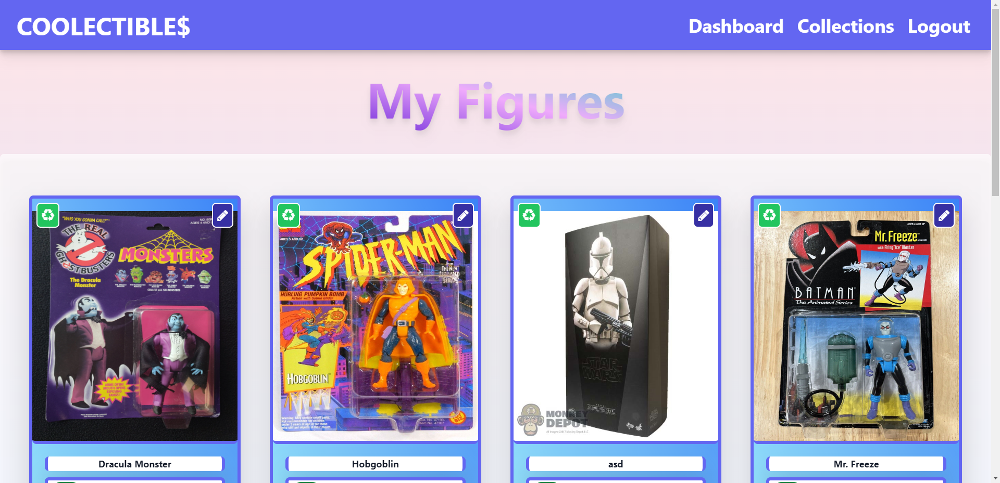

# COOLECTIBLES - Collection Database

## [GitHub Repository](https://github.com/ds055/collectible-database)
 

## [Deployed Link Using Heroku](https://github.com/ds055/collectible-database)

 

## Table of Contents

- [Preview](#preview)
- [Overview](#overview)
- [Technologies Used](#technologies-used)
- [License](#license)

## Preview

## Overview
Coolectibles is a web application specifically designed to cater to the needs of collectors and hobbyists. It provides a comprehensive platform for users to manage, display, and cherish their collection of various items - be it cards, action figures, coins, or music albums. It's not just about managing collections; it's about creating a personalized showcase, bringing your treasured items to life.

## Technologies Used

- `Node.js` and `Express.js` to create a robust back-end with a RESTful API.
- `Handlebars.js` serving as the template engine for dynamic content rendering.
- `MySQL` and `Sequelize ORM` for efficient database management and operations.
- Adherence to the `MVC` (Model-View-Controller) design paradigm for a well-structured codebase.
- `Multer` and `Cloudinary` to provide an image uploading feature for personalization of collections.
- `express-session` and `connect-session-sequelize` libraries for secure user authentication and session management.
- Environment variables for protecting sensitive data and information.

## License

This project is licensed under the terms of the MIT license. You can read more about this license [here](https://opensource.org/licenses/MIT).